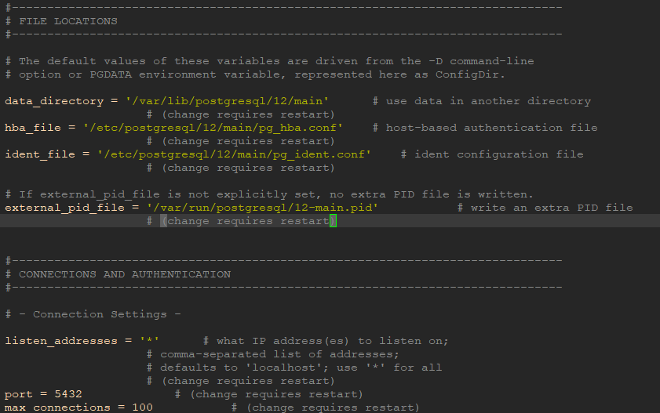
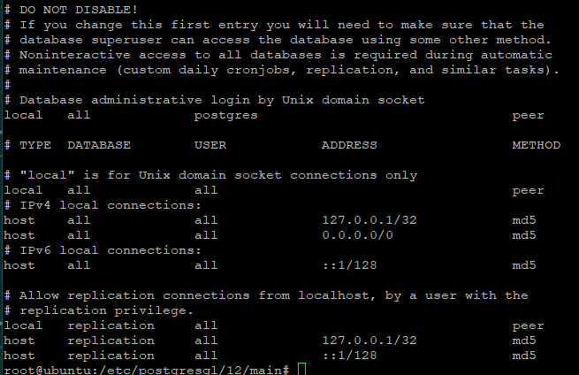

# PostgreSQL
refer to onenote 银行金融 - 管理 - PostgreSQL and https://blog.logrocket.com/setting-up-a-remote-postgres-database-server-on-ubuntu-18-04/

1. [Configuration](#Configuration)

steps | note
------- | --------------
install | find tutorial in network
free fire wall | sudo ufw allow 5432/tcp
restart service | sudo systemctl restart postgresql

## Configuration

